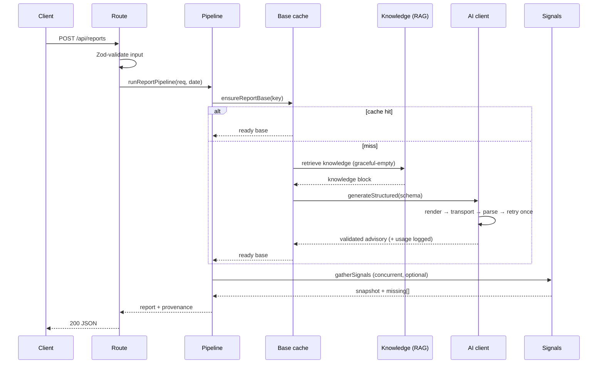

# Architecture

This document walks the system from request to response, then explains the
handful of decisions that shape everything else. Each decision has a dedicated
ADR in [docs/decisions/](docs/decisions/).

## Components

| Area | Path | Responsibility |
|---|---|---|
| AI client | `src/ai/` | The single choke point for model calls: template render, transport, structured output, cost logging |
| Transports | `src/ai/providers/` | OpenAI-compatible transport (prod) and mock transport (tests) behind one interface |
| Report engine | `src/reports/` | Cache state machine (L1/L2), RAG seam, prompt config, pipeline orchestrator |
| RAG | `src/rag/` | Embeddings, chunking, tag filters; retrieval is graceful-empty |
| Signals | `src/signals/` | Pluggable external-data providers, each optional |
| Persistence | `src/db/` | The `QueryExecutor` seam; the pg driver imported in one adapter |
| Billing | `src/billing/` | Idempotent webhook processing, entitlement mapping |
| Migrations | `db/migrations/` | Schema truth; RLS in the same migration as each table |
| Evaluation | `evals/` | LLM-as-judge harness over a committed golden set |
| API | `src/app/api/` | Thin HTTP adapters over the library |
| Shared | `src/shared/` | Error taxonomy, Result type |

## Request lifecycle

The **cold path** (cache miss) does the expensive work: retrieval plus a model
call. The **warm path** (hit) touches only the store and the signal providers,
so it is fast and free of model cost.

## Caching model (ADR-003)

A report base is keyed by the inputs that determine its durable content —
subject, region, period, normalized parameters — and nothing that changes
minute to minute. On a miss, a **guarded insert** makes exactly one caller the
owner of generation; concurrent callers poll until the owner finishes. A
crashed owner (stale `generating` row) or a prior failure is reclaimed and
retried. Live, fast-moving inputs belong to the signal layer, not the base.

## Degradation strategy (ADR-004)

Nothing the model or the network owns is allowed to become a single point of
failure. Retrieval returns empty on any error. Each signal provider returns
null independently and is simply absent from the result. The one deterministic
signal provider always resolves, so the conditions section is never empty. A
base-generation failure is the only hard failure, and it surfaces as an honest
error, never a hang.

## Cost and evaluation

Every model call logs a usage record (tokens, latency, estimated cost) through
one sink (ADR-008), so "cost per report" is a query. Prompt configuration is
data, not code (ADR-006), so a wording or model change is reviewable and
revertable. The full build adds an LLM-as-judge eval harness that grades
prompt changes against a committed golden set before they ship.

## What is a seam, and why

The transport, the report store, the knowledge source, and the signal providers
are all interfaces with a concrete implementation chosen in one composition root
(`src/reports/runtime.ts`). That is what lets the same code run against a mock
in tests and a real provider in production, and what makes "swap the vector DB"
or "add a weather feed" a local change instead of a refactor.
