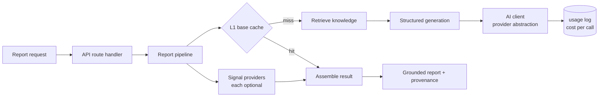

# rag-report-platform

**Production-grade reference implementation for retrieval-grounded, multi-source AI report generation.**

  

> This repository is a sanitized reference implementation inspired by production experience. Proprietary business logic, customer data, prompts, workflows, integrations, and commercial features have intentionally been omitted. The goal is to demonstrate engineering patterns, not to ship a product.

---

## What this is

A working, tested system that generates **structured, grounded AI reports** from two ingredients: a curated **knowledge corpus** (retrieved with RAG) and **live external data signals**. It caches in layers so a warm request is near-instant and near-free, and it degrades honestly when any single dependency is down.

The domain is deliberately neutral ("conditions-aware advisory reports"). The point is the architecture, not the subject: swap the corpus and the signal providers and the same engine writes agronomy advisories, environmental briefings, or logistics guidance.

## Why it exists

Wiring a prompt to an API key is a demo. Production AI has to answer harder questions. How do you keep a model outage from taking down the product? How do you know a prompt change made things better, not worse? How do you keep per-request cost from drifting silently? How do you stop the model from being the slow, expensive part of every request? This repo is a set of answered questions.

## Three ideas do most of the work

**1. Every model call goes through one function.** `src/ai/client.ts` renders a versioned template, calls the provider through an **injectable transport**, validates output against a Zod schema with one corrective retry, and logs token counts and estimated cost on every call — success or failure. Because the transport is injected, the entire test suite runs offline and never touches the network.

**2. Reports are cached by what actually determines them.** A durable base (expensive, rarely changes) is generated once under a **double-generation lock** and reused. Live signals layer on top. The warm path never calls the model.

**3. The model is never a single point of failure.** Retrieval returns empty on any error and generation proceeds. Each signal provider degrades to null independently. A failed report is marked failed with an honest error, never left hanging.

## Architecture



Full detail in [ARCHITECTURE.md](ARCHITECTURE.md) and [docs/decisions/](docs/decisions/).

## Tech stack

TypeScript (strict) · Next.js 15 (App Router) · PostgreSQL + pgvector · Zod · Vitest · GitHub Actions. The AI transport targets any OpenAI-compatible endpoint over `fetch`, with no vendor SDK coupling. Migrations, a pg-backed store, a pgvector corpus, and RLS policies are included; the default runtime uses an in-memory store and cache so the app runs with zero infrastructure, and swapping in the Postgres implementations is a change to one composition file.

## Getting started

```bash
npm install
cp .env.example .env.local     # placeholders; fill locally to run against a real provider
npm test                       # offline, no network or key required (54 tests)
npm run typecheck
npm run check:rls              # every table has RLS + a policy
npm run check:migrations       # migrations are appended and ordered
npm run eval:dry               # eval harness plumbing, offline
npm run dev                    # then POST /api/reports
```

```bash
curl -X POST localhost:3000/api/reports \
  -H 'content-type: application/json' \
  -d '{"subject":"coastal site conditions","region":"central gulf coast","period":"october","targetDate":"2026-10-15"}'
```

## What's inside

- **AI core** — one provider-abstracted client, structured output with a corrective retry, per-call cost logging, prompt configuration as versioned data.
- **Report engine** — L1 durable base cache with a double-generation lock, L2 live overlay with a deterministic fallback, an orchestrator with honest failure handling and full provenance.
- **RAG** — a pgvector corpus with an HNSW index and a `match_chunks` function, graceful-empty retrieval, and a coverage-gap demand signal; chunking plus an offline-capable seeding CLI.
- **Signals** — a `SignalProvider` seam with a deterministic temporal provider and a network-backed weather provider, each optional.
- **Data + security** — migrations as the single source of schema truth, RLS enabled in the same migration as each table and enforced by a CI gate, a secrets policy with gitleaks and an `.env.example` guard test.
- **Billing** — idempotent webhook processing via an event-id ledger, entitlement mapping that fails closed.
- **Evaluation** — an LLM-as-judge harness scoring a committed golden set on a fixed rubric.
- **Tooling** — CI running typecheck, lint, test, RLS coverage, migration order, build, secret scan, and CodeQL. 54 offline tests.

## Documentation

- [ARCHITECTURE.md](ARCHITECTURE.md) — the anchor: components, request lifecycle, degradation strategy.
- [docs/architecture/](docs/architecture/) — overview, caching model, RAG pipeline, signal providers, data model.
- [docs/ai/](docs/ai/) — prompt versioning, structured output, evaluation.
- [docs/api/reports-api.md](docs/api/reports-api.md) — request/response contract and error taxonomy.
- [docs/deployment/ci-cd.md](docs/deployment/ci-cd.md) — the gate stack.
- [docs/decisions/](docs/decisions/) — twelve ADRs, one per non-obvious choice.

## License

MIT. See [LICENSE](LICENSE).
