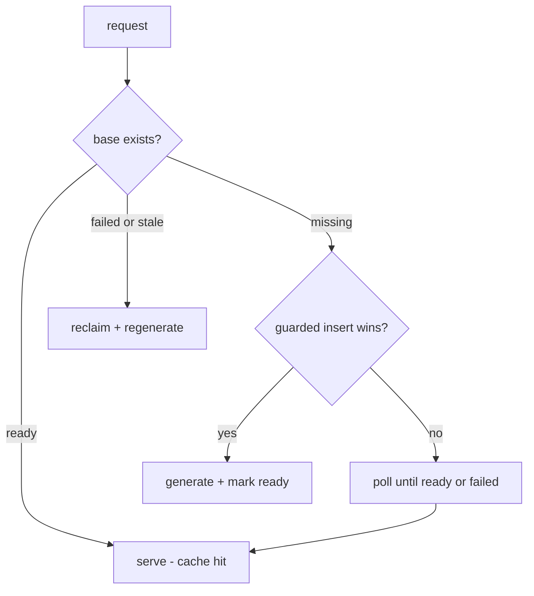

# Caching model

Two cache layers plus signal caching keep the warm path fast and cheap while
keeping content correct.

## L1 — the durable base (`report_bases`)

Keyed by the inputs that determine long-lived content: subject, region, period,
normalized parameters. Generating a base is the expensive step (retrieval plus a
model call), so it happens once per key.

On a miss, a guarded insert makes exactly one caller the generation owner:

The guard is the database's own conflict handling
(`INSERT ... ON CONFLICT DO NOTHING`), so no distributed lock service is needed.
A crashed owner leaves a stale `generating` row, reclaimed after a timeout.

## L2 — the live overlay (`conditions_cache`)

A short, time-sensitive adjustment layered on the base, but only when the target
date is inside a 7-day window. Cached per (base, date) with a 30-minute TTL, and
backed by a deterministic fallback (ADR-004): if the overlay model call fails,
the overlay is built from raw signals instead. Outside the window there is no
overlay at all — the durable base stands alone.

## Signal caching

Signal snapshots are cached per (location, data type) with a TTL, so repeat
requests inside the window do not re-hit an external feed.

## Provenance

Every response records what was served from cache and what was produced now
(`cacheHit`, `overlayCacheHit`, `missingSignals`). A degraded or cached result
is never silently indistinguishable from a fresh, fully grounded one.
