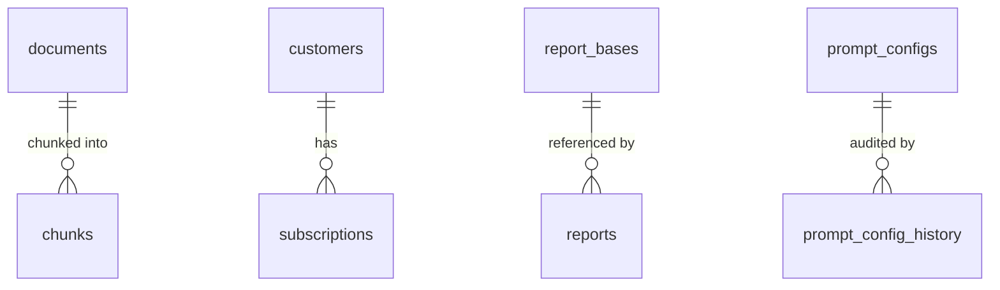

# Data model

Schema is defined only in `db/migrations` (ADR-012). RLS is enabled in the same
migration as each table and verified in CI (ADR-007).

## Tables

| Table | Schema | Ownership | Purpose |
|---|---|---|---|
| `prompt_configs` | public | internal | Versioned prompt configuration (ADR-006) |
| `prompt_config_history` | public | internal | Audit trail of config changes |
| `ai_usage_log` | public | internal | Per-call cost ledger (ADR-008) |
| `report_bases` | public | internal | L1 durable base cache (ADR-003) |
| `conditions_cache` | public | internal | Signal + overlay TTL cache |
| `rag.documents` | rag | internal | Corpus documents |
| `rag.chunks` | rag | internal | Embedded chunks + HNSW index (ADR-002) |
| `events` | public | internal | First-party events incl. coverage gaps |
| `customers` | public | user-owned | Billing customer link |
| `subscriptions` | public | user-owned | Entitlement state |
| `webhook_events` | public | internal | Idempotency ledger (ADR-011) |
| `reports` | public | user-owned | Per-user report requests |

## Tenancy

User-owned tables carry `owner_id` and have RLS policies scoping reads and
writes to `app_current_user_id()`, a helper that reads a per-request GUC the app
sets to the authenticated user. Internal tables enable RLS with a
deny-by-default policy (`using (false)`); they are reached only by the
service-role connection used server-side. The result is that isolation lives in
the database, and the CI gate proves every table has a policy.

## Relationships

