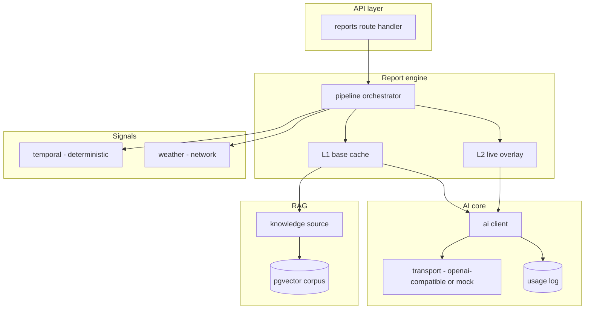

# Architecture overview

The system turns a request (subject, region, period, target date) into a
structured, grounded advisory. It does so through a small set of components with
clear boundaries, each depending on interfaces rather than concrete
implementations.

## Boundaries that matter

- **AI core** (`src/ai`) is the only code that talks to a model. It renders
  templates, calls an injected transport, validates structured output, and logs
  cost. Nothing else constructs a model request.
- **Report engine** (`src/reports`) owns the cache state machine and the
  orchestration. It depends on a `ReportStore`, a `KnowledgeSource`, a
  `ConditionsCache`, and a set of `SignalProvider`s — all interfaces.
- **RAG** (`src/rag`, `src/reports/*knowledge*`) embeds and retrieves, and is
  graceful-empty end to end.
- **Signals** (`src/signals`) are independent, optional data sources behind one
  interface.
- **Persistence** (`src/db`) is a single narrow `QueryExecutor` seam; the pg
  driver is imported in exactly one adapter file.

## Composition

`src/reports/runtime.ts` is the one place concrete implementations are chosen.
Everything upstream is testable against doubles, which is why the suite runs
offline. Swapping the in-memory store for Postgres, or adding a signal provider,
is a change to that one file.
