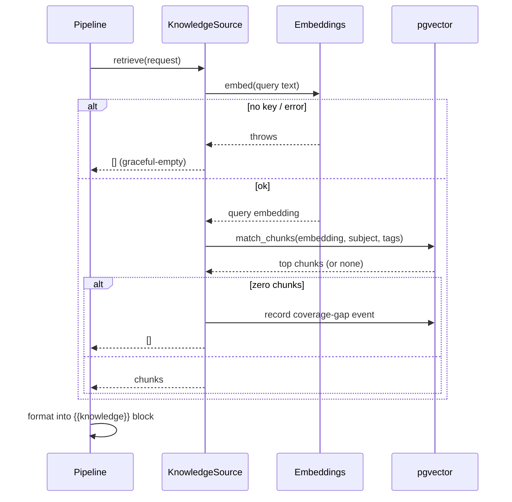

# RAG pipeline

Retrieval grounds generation in curated knowledge without ever becoming a point
of failure.

## Ingestion

Documents are chunked on paragraph boundaries up to a character budget
(`src/rag/chunking.ts`), embedded (`src/rag/embeddings.ts`), and stored in
`rag.chunks` with subject and tag columns. The seeding CLI (`scripts/rag/embed.ts`)
runs offline with `--dry-run` to validate the chunk plan.

## Retrieval

The request is embedded, matched via the `rag.match_chunks` function (cosine
over HNSW, filtered by subject and tags), and the top chunks are formatted into
the prompt's `{{knowledge}}` block. Every step is graceful-empty (ADR-009): the
report is generated with whatever context is available, and a coverage gap
becomes a tracked demand signal rather than a silent quality hole.
